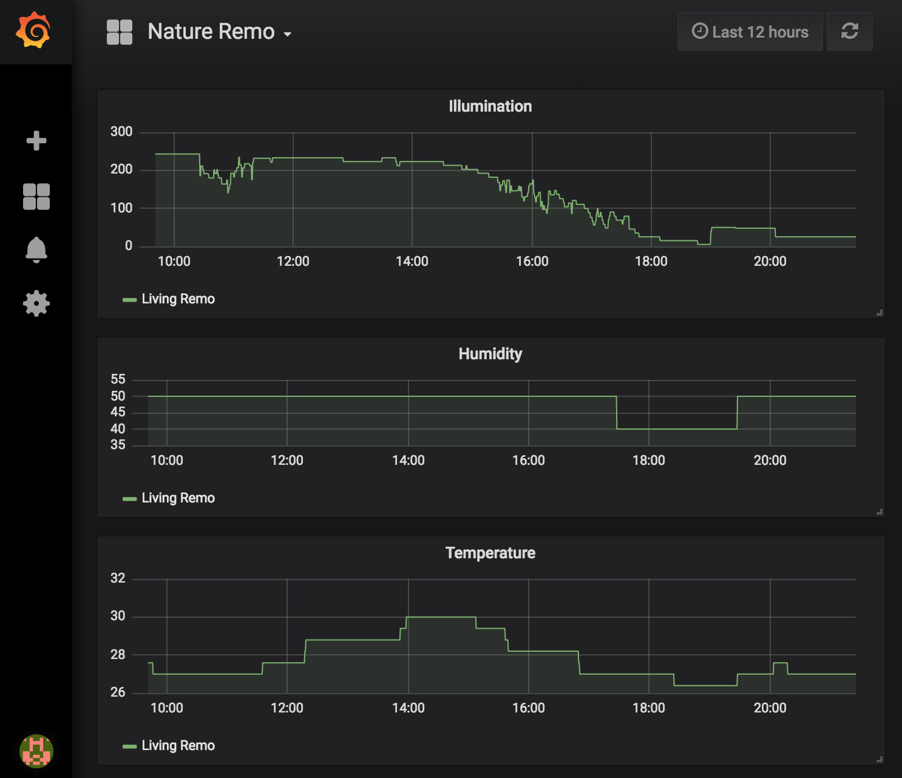

# Prometheus Nature Remo Exporter

[](https://codecov.io/gh/kenfdev/remo-exporter)

Exposes Nature Remo devices metrics to Prometheus.

## Configuration

This exporter is configurable via environment variables:

### Required

* `OAUTH_TOKEN` The OAuth token to be used for requests. Get one from [here](https://developer.nature.global/)

### Optional

* `METRICS_PATH` The metrics URL path. Default `/metrics`.
* `API_BASE_URL` The Remo API base URL. Default `https://api.nature.global`.
* `PORT` The port to be used by the exporter. Default `9352`.
* `CACHE_INVALIDATION_SECONDS` This exporter caches results for this perios of seconds. Default `60`.

## Metrics

The following is a sample metrics you can get from this exporter:

```plain
# HELP remo_humidity The humidity of the remo device
# TYPE remo_humidity gauge
remo_humidity{id="xxxxxxxx-xxxx-xxxx-xxxx-xxxxxxxxxxxx",name="Living Remo"} 50
# HELP remo_illumination The illumination of the remo device
# TYPE remo_illumination gauge
remo_illumination{id="xxxxxxxx-xxxx-xxxx-xxxx-xxxxxxxxxxxx",name="Living Remo"} 141.8
# HELP remo_temperature The temperature of the remo device
# TYPE remo_temperature gauge
remo_temperature{id="xxxxxxxx-xxxx-xxxx-xxxx-xxxxxxxxxxxx",name="Living Remo"} 28.2
```

## Usage

There's a sample `docker-compose.yml` to be used to test this exporter with prometheus and grafana. Hit the command below:

```bash
REMO_OAUTH_TOKEN=<YOUR_OAUTH_TOKEN> docker-compose up
```

## Grafana

The following is what it would look like with integration with Grafana:



## Development

### Creating mocks

This project uses mockgen to create mocks. The following is an example of creating mocks.

```
mockgen -source ./config/reader.go -destination ./mocks/reader.go -package mocks
```