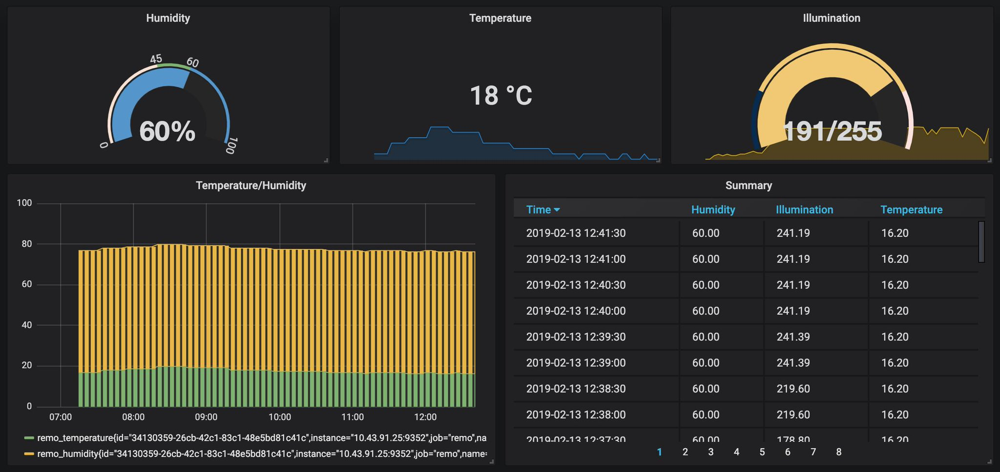

# Prometheus Nature Remo Exporter

[](https://circleci.com/gh/kenfdev/remo-exporter) [](https://codecov.io/gh/kenfdev/remo-exporter)

Exposes Nature Remo and Nature Remo E lite devices metrics to Prometheus.

## Configuration

This exporter is configurable via environment variables:

### Required

Either `OAUTH_TOKEN_FILE` (recommended) or `OAUTH_TOKEN` should be set.

- `OAUTH_TOKEN_FILE` The path to the file where the OAuth token is stored. Usually you will mount a secret here.
- `OAUTH_TOKEN` The OAuth token to be used for requests. Get one from [here](https://developer.nature.global/)

### Optional

- `METRICS_PATH` The metrics URL path. Default `/metrics`.
- `API_BASE_URL` The Remo API base URL. Default `https://api.nature.global`.
- `PORT` The port to be used by the exporter. Default `9352`.
- `CACHE_INVALIDATION_SECONDS` This exporter caches results for this perios of seconds. Default `60`.

## Metrics

The following is a sample metrics you can get from this exporter:

```plain
# HELP remo_humidity The humidity of the remo device
# TYPE remo_humidity gauge
remo_humidity{id="xxxxxxxx-xxxx-xxxx-xxxx-xxxxxxxxxxxx",name="Living Remo"} 50
# HELP remo_illumination The illumination of the remo device
# TYPE remo_illumination gauge
remo_illumination{id="xxxxxxxx-xxxx-xxxx-xxxx-xxxxxxxxxxxx",name="Living Remo"} 141.8
# HELP remo_temperature The temperature of the remo device
# TYPE remo_temperature gauge
remo_temperature{id="xxxxxxxx-xxxx-xxxx-xxxx-xxxxxxxxxxxx",name="Living Remo"} 28.2
# HELP remo_motion The motion of the remo device
# TYPE remo_motion gauge
remo_motion{id="xxxxxxxx-xxxx-xxxx-xxxx-xxxxxxxxxxxx",name="Living Remo"} 1.568608471e+09
```

If you have a Nature Remo E lite, you can also get the following metrics:

```plain
# HELP remo_cumulative_electric_energy_kilowatt The cumulative electric energy of the remo e lite
# TYPE remo_cumulative_electric_energy_kilowatt counter
remo_cumulative_electric_energy_kilowatt{id="xxxxxxxx-xxxx-xxxx-xxxx-xxxxxxxxxxxx",name="Remo E lite"} 5094.8
# HELP remo_measured_instantaneous_energy_watt The measured instantaneous energy of the remo e lite
# TYPE remo_measured_instantaneous_energy_watt gauge
remo_measured_instantaneous_energy_watt{id="xxxxxxxx-xxxx-xxxx-xxxx-xxxxxxxxxxxx",name="Remo E lite"} 529
```

## Usage

### docker-compose

There's a sample `docker-compose.yml` to be used to test this exporter with prometheus and grafana. Hit the command below:

```bash
REMO_OAUTH_TOKEN=<YOUR_OAUTH_TOKEN> docker-compose up
```

### Swarm

#### Create a secret for the oauth token

Create a file which contains the oauth token.(e.g. `token-file` )

```bash
# token-file (be sure not to contain a new line!)
<YOUR-OAUTH-TOKEN>
```

Create the secret

```bash
docker secret create api-keys token-file
```

#### Deploy the stack

```bash
./swarm/deploy_stack.sh
```

#### Access the metrics

The following is an example url for the NodePort(30352):

http://localhost:9352/metrics

### Kubernetes

#### Prepare namespace

```bash
# This creates a remo namespace
kubectl apply -f k8s/namespace.yaml
```

#### Create a secret for the oauth token

Create a file which contains the oauth token.(e.g. `api-keys` )

```bash
# api-keys (be sure not to contain a new line!)
<YOUR-OAUTH-TOKEN>
```

Create the secret

```bash
kubectl -n remo create secret generic api-keys --from-file=api-keys
```

#### Deploy

```bash
# deploy common resources
kubectl apply -f ./k8s/yaml

# if arch is amd64
kubectl apply -f ./k8s/yaml-amd64

# if arch if armhf
kubectl apply -f ./k8s/yaml-armhf
```

#### Access the metrics

The following is an example url for the NodePort(30352):

http://localhost:30352/metrics

## Grafana

The following is what it would look like with integration with Grafana:



## Development

### Creating mocks

This project uses mockgen to create mocks. The following is an example of creating mocks.

```
mockgen -source ./config/reader.go -destination ./mocks/reader.go -package mocks
```
