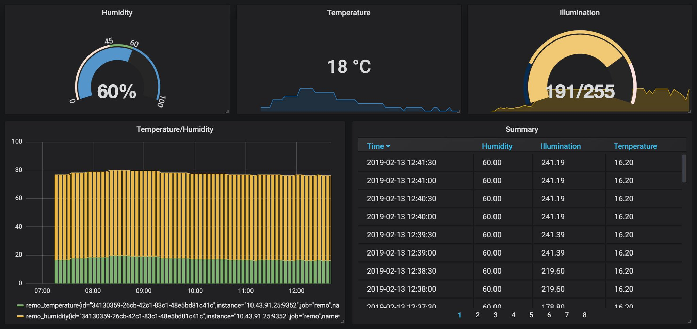

# Prometheus Nature Remo Exporter

Exposes Nature Remo and Nature Remo E lite device metrics to Prometheus.

## Configuration

Configure the exporter with environment variables.

### Required

Set either `OAUTH_TOKEN_FILE` (recommended) or `OAUTH_TOKEN`.

- `OAUTH_TOKEN_FILE` is the path to a file containing the OAuth token. It takes precedence over `OAUTH_TOKEN`. Surrounding whitespace is removed.
- `OAUTH_TOKEN` is the token used for API requests. Get a token from the [Nature developer portal](https://developer.nature.global/).

### Optional

- `METRICS_PATH` is the metrics URL path. Default `/metrics`.
- `API_BASE_URL` is the Remo API base URL. Default `https://api.nature.global`.
- `PORT` is the exporter port. Default `9352`.
- `CACHE_INVALIDATION_SECONDS` is the cache lifetime in seconds. Default `60`. Set `0` to fetch fresh data on every scrape.

Each upstream API request has a fixed five-second timeout. An uncached scrape can make two sequential API requests, so those requests can take nearly ten seconds. This is not an overall scrape deadline.

## Metrics

Device metrics have `name` and `id` labels. Sensor metrics appear when the API returns their corresponding events.

```plain
# HELP remo_humidity The humidity of the remo device
# TYPE remo_humidity gauge
remo_humidity{id="xxxxxxxx-xxxx-xxxx-xxxx-xxxxxxxxxxxx",name="Living Remo"} 50
# HELP remo_illumination The illumination of the remo device
# TYPE remo_illumination gauge
remo_illumination{id="xxxxxxxx-xxxx-xxxx-xxxx-xxxxxxxxxxxx",name="Living Remo"} 141.8
# HELP remo_temperature The temperature of the remo device
# TYPE remo_temperature gauge
remo_temperature{id="xxxxxxxx-xxxx-xxxx-xxxx-xxxxxxxxxxxx",name="Living Remo"} 28.2
# HELP remo_motion The motion of the remo device
# TYPE remo_motion gauge
remo_motion{id="xxxxxxxx-xxxx-xxxx-xxxx-xxxxxxxxxxxx",name="Living Remo"} 1.568608471e+09
```

`remo_motion` is the Unix timestamp in seconds of the latest motion event.

`remo_device_online` is a gauge with the same `name` and `id` labels. It is `1` when the API reports `online: true` and `0` for `online: false`. If `online` is absent or null, the exporter omits the metric for that device. Online status does not require sensor events.

### Electricity metrics

For Nature Remo E lite smart meters, the exporter exposes the current ECHONET Lite property values. These metrics have `name` and `id` labels for the device.

| Metric | Type | Value |
| --- | --- | --- |
| `remo_normal_direction_cumulative_electric_energy` | Counter | Raw cumulative meter reading in the normal direction |
| `remo_reverse_direction_cumulative_electric_energy` | Counter | Raw cumulative meter reading in the reverse direction |
| `remo_coefficient` | Gauge | Multiplier for the raw cumulative readings |
| `remo_cumulative_electric_energy_unit_kilowatt_hour` | Gauge | Decoded unit multiplier in kWh |
| `remo_cumulative_electric_energy_effective_digits` | Gauge | Number of effective digits in a cumulative reading |
| `remo_measured_instantaneous_energy_watt` | Gauge | Measured instantaneous power in watts |

Multiply a raw cumulative reading by its coefficient and unit to obtain kWh. For example, use this PromQL expression for the normal direction:

```promql
remo_normal_direction_cumulative_electric_energy
	* remo_coefficient
	* remo_cumulative_electric_energy_unit_kilowatt_hour
```

The exporter does not emit a precomputed cumulative kWh metric or retrieve historical electricity data. See [exporter/exporter.go](exporter/exporter.go) for metric definitions and [exporter/smart_meter.go](exporter/smart_meter.go) for property decoding.

## Usage

The examples use `kenfdev/remo-exporter:latest`. The exporter build targets are Linux amd64, arm64, and ARMv7.

The monitoring examples pin [Prometheus 2.55.1](https://github.com/prometheus/prometheus/releases/tag/v2.55.1) as an interim update within major version 2. This pin is not a claim of current upstream support.

The examples pin [Grafana 13.2.3](https://grafana.com/grafana/download/13.2.3?edition=oss&platform=docker). As of October 3, 2026, Grafana lists 13.2.x under [patch support through May 18, 2027](https://grafana.com/docs/grafana/latest/upgrade-guide/when-to-upgrade/). The [image metadata](https://hub.docker.com/v2/repositories/grafana/grafana/tags/13.2.3) advertises Linux amd64, arm64, and ARMv7 variants. Container startup on these architectures still requires runtime verification. No Nature Remo hardware integration was tested for this maintenance update.

These are test deployments. Configure persistent storage, access controls, and backups before using them in production.

### Docker Compose v2

Create an `api-keys` file in the repository root containing your OAuth token. Keep this file out of source control. The repository's `.gitignore` excludes it.

The Compose sample mounts this local file at `/run/secrets/api-keys`. The file must be readable by the container's `exporter` user. Local file-backed secrets are bind mounts, so protect the host file and its parent directory.

From the repository root, validate and start the stack:

```bash
docker compose config
docker compose up -d
```

Open the exporter at <http://localhost:9352/metrics>, Prometheus at <http://localhost:9090>, and Grafana at <http://localhost:3000>.

### Swarm

On a Swarm manager, create an `api-keys` file containing your OAuth token. Create the external secret:

```bash
docker secret create api-keys api-keys
```

Deploy the stack:

```bash
./swarm/deploy_stack.sh
```

The script uses the standalone [Swarm Compose file](swarm/docker-compose.yml), which references the existing Swarm secret. Both Compose files use version 3.3 for compatibility with Docker stack's legacy format. The Prometheus bind mount requires `prometheus.sample.yml` at the resolved repository path on every node eligible to run Prometheus.

Open the exporter at port `9352` on a Swarm node, for example <http://localhost:9352/metrics> when the node is local.

### Kubernetes

Create the namespace:

```bash
kubectl apply -f k8s/namespace.yml
```

Create an `api-keys` file containing your OAuth token, then create the secret:

```bash
kubectl -n remo create secret generic api-keys --from-file=api-keys
```

Deploy the common resources:

```bash
kubectl apply -f k8s/yaml
```

Deploy one Prometheus example. For amd64 or arm64:

```bash
kubectl apply -f k8s/yaml-amd64
```

For ARMv7:

```bash
kubectl apply -f k8s/yaml-armhf
```

Both Prometheus examples use the same multi-architecture image. The [release build configuration](https://github.com/prometheus/prometheus/blob/v2.55.1/Makefile) includes amd64, arm64, and ARMv7. Their directory names remain for existing users.

Open the exporter at port `30452` on a Kubernetes node, for example <http://localhost:30452/metrics> when the node is local.

## Grafana

A sample dashboard:



## Development

### Test and build

GitHub Actions runs tests and builds with Go 1.26 and 1.27. The workflow in [.github/workflows/ci.yml](.github/workflows/ci.yml) does not publish images or upload artifacts or coverage.

Run the tests locally:

```bash
go test -race ./...
```

Build Linux binaries:

```bash
./scripts/build-bin.sh
```

The build script resolves the repository from its own location. It writes these binaries regardless of the working directory:

- `dist/remo-exporter-linux-amd64`
- `dist/remo-exporter-linux-arm64`
- `dist/remo-exporter-linux-armv7`

Run the mock-API smoke check against the amd64 binary:

```bash
python3 scripts/smoke-test.py dist/remo-exporter-linux-amd64
```

This check uses a local API fixture. It does not require a Nature Remo token or device.

### Publish images manually

Automatic publishing is disabled. Only an authorized maintainer may publish from a non-CI environment. The push script requires an explicit opt-in and rejects CI invocations.

The image build runs commands for amd64, arm64, and ARMv7. Your Docker builder must support those platforms through native workers or configured emulation. The script does not install emulation.

Build the binaries, then build images for a release tag:

```bash
./scripts/build-bin.sh
./packaging/docker/build-image.sh vX.Y.Z
```

After reviewing the images and authenticating to Docker Hub, explicitly publish them:

```bash
./packaging/docker/push-image.sh --publish vX.Y.Z
```

The optional repository argument defaults to `kenfdev/remo-exporter`. Pass the same repository to both image scripts when using another destination. A tag alone never authorizes publishing.

### Create mocks

The project uses `mockgen` to create mocks. For example:

```bash
go run go.uber.org/mock/mockgen@v0.6.0 -source ./config/reader.go -destination ./mocks/reader.go -package mocks
```
